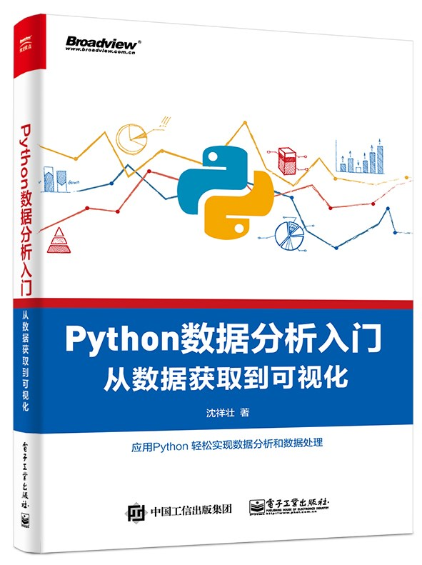

# 《Python数据分析入门——从数据获取到可视化》

## 概览

书籍[《Python数据分析入门——从数据获取到可视化》](http://www.broadview.com.cn/book/5010)
中使用的所有源代码，数据等文件。
关于本书的一些最新的进展的也会第一时间在这里公布。 
希望本书能对大家有所帮助。

## 反馈&勘误
### 问题反馈

- Issue/Discussion: 对于代码的问题可以提交Issue，对于其他问题可以在Discussion中讨论。
- Email: 也可以发邮件给我(datahonor@gmail.com)我会定期查看并尽快回复。

### 勘误

| 页码      | 错误                                          | 改正       |
|---------|---------------------------------------------|----------|
| 201     | 上方第一个阴影框（训练集数据）“种类”列最后两行将“bumpy”全改为“orange” | 第二次印刷时更正 |
| 202     | 第三行，“是橙子还是水果”改为“是橙子还是苹果”                    | 第二次印刷时更正 |
| 99      | 代码框最后两行交换位置（因为多线程会把`urls`清空）                | 第六次印刷时更正 |
| 115     | 正文第三行“运行输出如下。”下面的输出有误，下面的数据需要我们自己手动创建       | 第六次印刷时更正 |
| 245     | 代码框，最上面应加上`import random as rnd`            | 第六次印刷时更正 |
| 247,248 | 两个LP问题的目标函数漏掉                               | 第六次印刷时更正 |
| 71-73   | 豆瓣模拟登录报错                                    | 第六次印刷时更正 |

